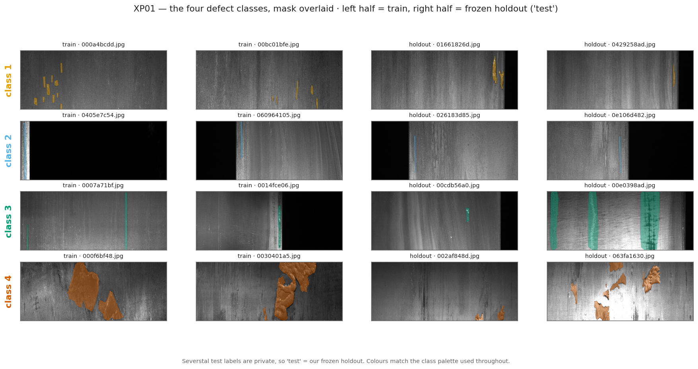

# XP01 — Baseline model

**Question.** Can we train a *competent* steel-defect model?

Not a winning one. XP01 exists to produce a model good enough that its **degradation under
drift is meaningful** — everything from XP06 onward measures changes against this baseline,
so the baseline has to be stable and honestly measured, not maximal. Tuning for the
leaderboard here would buy nothing the rest of the project can use.

**Status:** data profiled ✅ · model not yet trained ⬜

## The data

Severstal train split, `data/severstal/` (see [`data/download.md`](../../data/download.md)).
Profiled by [`profile_data.py`](profile_data.py) → [`results/xp01_data_profile.json`](../../results/xp01_data_profile.json).

| | |
|---|---|
| Images | **12,568**, all **1600 × 256** (W × H) — wide strips, ~6.25:1 |
| With ≥1 defect | 6,666 |
| **Clean (no defect)** | **5,902 — 47%** |
| Annotation rows | 7,095 |
| Multi-class images | 427 |
| Test set | 5,506 images, **labels private → unusable for measurement** |

### The defect classes

**Severstal never published what ClassId 1–4 mean.** The classes are anonymous by design —
there is no official mapping to "scratch", "inclusion", "pitting" or anything else, and any
source that gives you one is guessing. What we *can* state is measured geometry, from the
masks themselves:

| Class | Instances | Images | Share | Median area | Median % of image | Median bbox (w×h) | Fill ratio |
|---|---:|---:|---:|---:|---:|---:|---:|
| **1** | 897 | 897 | 12.6% | 3,326 px | 0.81% | 58 × 165 | 0.39 |
| **2** | **247** | 247 | **3.5%** | 2,944 px | 0.72% | **24 × 208** | **0.66** |
| **3** | **5,150** | 5,150 | **72.6%** | 11,954 px | 2.92% | 306 × 255 | 0.30 |
| **4** | 801 | 801 | 11.3% | **25,357 px** | **6.19%** | 363 × 210 | 0.44 |

*Fill ratio = defect pixels ÷ bounding-box area. Near 1.0 is a solid blob; low is a thin or
wispy shape.*

Read across the rows and the four classes are genuinely different problems:

- **Class 2 is the hard one.** 247 examples — a **21× imbalance** against class 3 — and the
  narrowest shape in the set (median 24 px wide on a 1600 px strip, but 208 px tall, i.e. a
  near-vertical streak spanning most of the strip height). Rare *and* thin is the worst
  combination for a segmentation model: it contributes almost nothing to a pixel-averaged
  loss, and a few pixels of boundary error wreck its Dice. **Expect class 2 to be the first
  thing that breaks, and expect XP04 to find its calibration is the worst of the four** —
  exactly the case the plan predicts an unchanged mean will hide.
- **Class 3 dominates.** 72.6% of all annotations. A model that only ever predicts class 3
  will look respectable on a mean-Dice metric. This is the failure mode to guard the
  baseline against.
- **Class 4 is large and solid** — median 6.2% of the image, up to 47%. Easiest to
  segment; least informative about drift sensitivity.
- **Classes 1 and 3 are wispy** (fill 0.39 / 0.30) — they scatter across their bounding box
  rather than filling it, which is why coarse or downsampled predictions smear them.
- Area spans four orders of magnitude: class 3 runs from 0.03% to **89.9%** of the image.
  Any single resize or crop strategy trades one end of that range against the other.

### Class co-occurrence

Almost all defective images carry exactly one class:

| Combination | Images |
|---|---:|
| 3 only | 4,759 |
| 1 only | 769 |
| 4 only | 516 |
| **3 + 4** | **284** |
| 2 only | 195 |
| 1 + 3 | 91 |
| 1 + 2 | 35 |
| 2 + 3 | 14 |
| 1+2+3 | 2 |
| 2 + 4 | 1 |

**Classes 1 and 4 never co-occur** (0 images). 3+4 is the only common pairing. So the task
is close to — but not exactly — single-label, which means **four independent binary masks,
not a 5-way softmax**. A softmax would assert mutual exclusivity that 427 images violate.

## Don't train from scratch — what's actually available

Surveyed 2026-07-23. **Almost nobody published Severstal-trained weights.** Every
well-known solution repo is code-only, and the winning solutions are multi-model ensembles
that a Jetson could not serve anyway.

| Source | Result | Weights? | Licence |
|---|---|---|---|
| Kaggle 1st place | **0.90883** private Dice | ❌ writeup only | — |
| [khornlund](https://github.com/khornlund/severstal-steel-defect-detection) | #55/2436, 0.90274 | ❌ code only (`download.sh` fetches *data*) | **none** |
| [TheoViel](https://github.com/TheoViel/kaggle_severstal) | ~#40 | ❌ | **none** |
| [VitalyPavlov](https://github.com/VitalyPavlov/Kaggle_Severstal) | 0.903 | ❌ | **none** |
| [zdaiot](https://github.com/zdaiot/Kaggle-Steel-Defect-Detection) | #96 (top 4%) | ❌ | MIT |
| [betty0/steel-defect-segmentation](https://huggingface.co/betty0/steel-defect-segmentation) | mask mAP50 **0.587** | ✅ **`.pt` + `.onnx`** | **AGPL-3.0** |

Two traps in that table:

- **"No licence" is not permissive.** A GitHub repo without a `LICENSE` file is
  all-rights-reserved by default. khornlund's 266-star repo included — the *code* is not
  licensed for reuse, never mind weights it does not ship.
- **`steven0226/steel-defect-segmentation` is a byte-identical mirror** of betty0's model
  card and weights (diff is 4 lines: repo URLs). It is not a second, independent option.

### The one downloadable model

**betty0 / steel-defect-segmentation** — YOLO26s-seg fine-tuned on Severstal, 4 classes,
ships both `.pt` and a NMS-free `.onnx`. Held-out val (734 images, seed 42, `imgsz=1024`):
mask mAP50 **0.587**, mAP50-95 0.232; 8.04 ms on an RTX 4090. Per class, mAP50: defect_1
0.537 · defect_2 0.543 · defect_3 0.625 · defect_4 0.642.

Its own card makes an honest observation worth carrying into XP01: **defect_2, the rarest
class, outscores defect_1 despite ~10× less data** — thin elongated shapes with ambiguous
boundaries hurt mask IoU more than scarcity does. That matches the geometry measured above
(class 1: fill 0.39, median 58 px wide) and warns against reading the 21× imbalance as the
whole story.

**Why it is not the default here.** Two reasons, neither about accuracy:

1. **AGPL-3.0.** Ultralytics weights are AGPL unless you hold an Enterprise licence.
   Network-served derivative works must publish source. For a demo on a company website
   that is a legal decision, not a technical one.
2. **Wrong output shape for the science.** This project lives or dies on XP04 (reliability
   diagrams, ECE), XP07 (confidence vs accuracy divergence) and XP08 (confidence/entropy
   distribution shift). Those need a **dense per-pixel probability map**. YOLO instance
   segmentation gives per-*instance* detection scores; there is no clean pixel-level
   reliability diagram to build from it, and XP03's "agreement rate — do the two models
   flag the same pixels?" gets awkward too.

### Decision

**Fine-tune a U-Net/FPN from [segmentation_models.pytorch](https://github.com/qubvel-org/segmentation_models.pytorch)**
(MIT, 11.7k stars, actively maintained) with an **ImageNet-pretrained** `resnet34` or
`efficientnet-b0` encoder.

This is *not* training from scratch — the encoder is pretrained and only the Severstal
fine-tune is ours, a few GPU-hours. It is also exactly what khornlund and the 1st-place
solution built on (SMP + EfficientNet/ResNet encoders, U-Net and FPN heads), minus the
ensemble. It gives:

- dense sigmoid probabilities per class → XP04/XP07/XP08 work as written;
- four independent binary masks → matches the co-occurrence structure above;
- a single small model → clean ONNX → TensorRT for XP02/XP03, and a meaningful
  monitoring-overhead denominator in XP12;
- MIT throughout.

**Target: ~0.88–0.90 holdout Dice.** Competent, not competitive — chasing the 0.909 winner
would mean an ensemble, which XP02 and XP12 cannot use.

**Keep betty0's ONNX as a cross-check.** Running it on the frozen holdout costs nothing and
gives an independent second opinion on our baseline — and if the AGPL question is resolved
in its favour, it becomes a zero-training fallback.

## Result — run 1: a competent c3/c4 detector, blind to c1/c2

**Trained on the Jetson Orin Nano itself** (CUDA, AMP, 20 epochs × ~6 min, ~2 h total).
U-Net / ResNet-34, 24.4 M params, Dice+BCE loss, defect-biased 256×256 crops + flips.

The honest frozen-holdout scorecard (`results/xp01_baseline.json`):

| Class | detection recall | detection F1 | defect-only Dice | Kaggle Dice (freebie) |
|---|---:|---:|---:|---:|
| **1** | **0.00** | **0.00** | **0.00** | 0.93 |
| **2** | **0.00** | **0.00** | **0.00** | 0.98 |
| 3 | 0.90 | 0.88 | 0.64 | 0.80 |
| 4 | 0.90 | 0.85 | 0.63 | 0.96 |

**The model never detects classes 1 or 2** — 0 true positives out of 134 and 36 holdout
defect images, even at the most permissive operating point (thr 0.3, no min-px floor). It
is a strong detector of classes 3 and 4 (recall 0.90, defect-Dice ~0.63) and blind to the
other two. This is run 1, not the final baseline — the fix is below.

### The metric trap this exposes (and why it matters for the whole project)

A single global threshold tuned on **mean Dice** gives a headline **0.918** on the holdout —
and it is a lie. Because 47% of images are clean and the competition scores an
empty-prediction-on-empty-target as **1.0**, mean Dice is *maximised* by suppressing
predictions on the rare classes and banking the freebie. The naive tuner drives `min_px`
all the way to 2000, which zeroes every c1/c2 prediction, and reports 0.92 for a model
that detects half the classes. This is the project's central thesis — *don't trust the
headline number* — appearing in its own baseline. We tune per-class operating points on
**detection F1** instead (F1 = 0 when recall = 0, so it cannot be gamed by abstention) and
report defect-only Dice as the real quality number.


*Left: training loss falls cleanly, 0.92 → 0.19. Right: the training-log Dice — but c1/c2's
flat high lines (0.93 / 0.98) are **abstention**, not skill: on a mostly-clean val set a
model that predicts nothing on a class scores ~1.0 there. That illusion is exactly what the
holdout scorecard below strips away.*


*The grey Kaggle-Dice bars (0.93, 0.98) for c1/c2 are pure freebie; defect-only Dice and
detection recall are flat at zero. c3/c4 are genuine.*


*Image-level detection on the 1,884-image holdout. c1/c2 have an empty predicted-defect
column: every one of their 134 / 36 defect images is called clean. c3/c4 catch ~90%.*


*One holdout defect per class: input · ground truth · model. c1/c2 — the model draws
nothing. c3 — clean match. c4 — catches the blob but also hallucinates c3 streaks (the c3
head is trigger-happy: 109 false positives).*

### Why c1/c2 collapsed — and the fix for run 2

It is not mysterious once you look at the data figure and the examples: class 3 is **72.6%
of all annotations**, and c1/c2 are the smallest, thinnest defects (c1 median 0.81% of the
image in scattered spots, c2 a ~24 px-wide streak). Per-class Dice in the loss still lets
c3's gradient dominate, and defect-biased cropping mostly surfaces c3. The model took the
cheap win: learn c3/c4, ignore c1/c2.

**Run 2 (next):** rebalance so the rare classes carry weight — inverse-frequency class
weights in the loss and/or class-balanced crop sampling (sample the defect *class* to crop
around uniformly, not whatever defect is present). Everything else — split, eval,
per-class F1 tuning, figures — stays; only `lib/models.DiceBCELoss` and the crop sampler in
`lib/data.py` change. A baseline that can't see two of four classes cannot anchor the drift
experiments (you can't measure drift-degradation on a class the model never detects), so
this is a gate before XP02.

### Data at a glance


*Why c1/c2 are hard: 21× rarer than c3, and the smallest/thinnest shapes.*


*The four (anonymous) classes with masks overlaid — train (left) vs frozen holdout (right).
c1 = scattered spots, c2 = thin vertical streak, c3 = vertical scratches, c4 = large
patches. The size gap is the whole story.*

## Method

1. **Split.** Test labels are private, so partition `train_images/` into
   train / val / **frozen holdout**. Stratify on the class combination above, not on class
   id, so the 427 multi-class images and the 5,902 clean images distribute properly. The
   holdout is sacred: touched once, at the end, and never for tuning (PLAN §8).
2. **Model.** SMP U-Net, ImageNet-pretrained `resnet34`/`efficientnet-b0` encoder — see the
   survey above. Boring on purpose.
3. **Input geometry.** 1600×256 is the plan's flagged trap. Options are full-strip, or
   tiling into ~256×256 crops — the choice interacts with the tiny-class-2 problem and with
   XP02's latency budget, so decide it with a measurement, not a preference.
4. **Loss.** Pixel-averaged BCE alone will ignore class 2. Dice/Tversky or class weighting
   is not optional here.
5. **Metrics on the frozen holdout.** Per-class Dice/IoU **and** an image-level
   defect/no-defect metric — with 47% clean images, the "is there anything here at all"
   decision is half the problem and is what XP04's calibration analysis will attach to.

## Deliverable

Trained model + baseline metrics on the frozen holdout, per class, with the clean-image
false-positive rate stated separately.

**Feeds:** XP02 (export/deploy), XP03 (certification reference), XP04 (calibration), and
the entire drift-degradation baseline from XP06 on.

## Reproduce

```bash
python experiments/xp01_baseline/profile_data.py     # data profile  -> results/xp01_data_profile.json
python experiments/xp01_baseline/make_split.py       # frozen split  -> results/xp01_split.json
python experiments/xp01_baseline/train.py --epochs 20 --batch-size 12   # ~2 h on the Orin Nano
python experiments/xp01_baseline/evaluate.py         # holdout metrics -> results/xp01_baseline.json
python experiments/xp01_baseline/make_figures.py     # all 7 figures  -> results/figures/xp01_*.png
```
