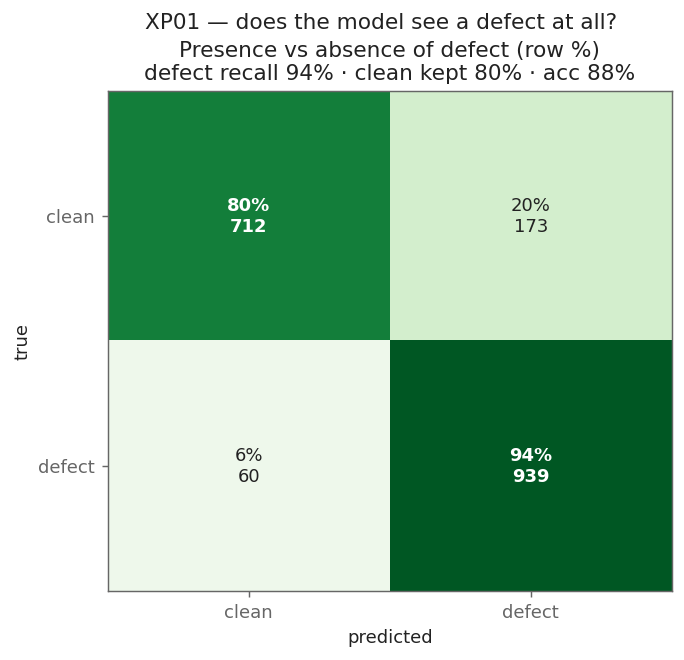
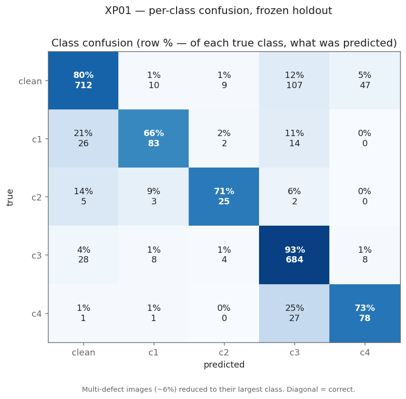

# XP01 — Baseline model

**Goal:** train a *competent* steel-defect model — good enough to measure drift against
later, not a leaderboard winner. Everything from XP06 on measures change against this
baseline, so it must detect all four classes and be honestly scored.

**Status:** trained and evaluated on the Jetson Orin Nano. ✅

## The data

Severstal training set (`data/severstal/`, see [download.md](../../data/download.md)):

| | |
|---|---|
| Images | **12,568** — all **1600 × 256** (wide strips) |
| Clean (no defect) | **5,902 (47%)** |
| With ≥1 defect | 6,666 |
| Defect classes | 4, with pixel masks |

The real Severstal test set has **private labels**, so we can't score on it. We carve our
own frozen test set out of the training data instead (see [Method](#method)).

### The four defect classes

Severstal never published what the classes *are* — no "scratch" / "pitting" names, they're
just 1–4. Measured from the masks:

| Class | Share of defects | Typical size | Shape |
|---|---:|---|---|
| **1** | 13% | small (~0.8% of image) | scattered spots |
| **2** | 3.5% | small & thin | vertical streak |
| **3** | **73%** | tiny → huge | scratches / lines |
| **4** | 11% | large (~6% of image) | solid patches |

- **Class 1** — scattered small spots.
- **Class 2** — the hard one: rarest (21× fewer than c3) and thinnest. Rare + thin = easy
  to miss.
- **Class 3** — the common one, 73% of all defects.
- **Class 4** — big solid patches, easiest to find.


*Training data: clean strips + the four defect classes, masks overlaid. The size gap
between the classes is the whole story.*

Almost every defective image has just **one** class; the only common pairing is 3+4, and
classes 1 and 4 never appear together. That's why the model outputs **4 independent masks**
rather than forcing one label per pixel — an image can have more than one defect.

## The model

- **Architecture:** U-Net with a **ResNet-34 encoder**, **fine-tuned** — the encoder starts
  from ImageNet weights; we only train on Severstal (a few GPU-hours, not from scratch).
- **Output:** 4 independent masks, one per defect (not a "pick one" softmax — an image can
  have several defects).
- **Balanced sampling:** each training crop targets a class drawn to boost the rare ones,
  so the model sees every class roughly equally instead of mostly class 3. Class imbalance
  is the main thing that makes small classes get ignored, and this is the fix.

**Loss = Tversky + BCE**, two terms added together:

- **BCE** (binary cross-entropy) grades each pixel "defect or not?". Alone it's fooled —
  47% of images are clean, so predicting *nothing* already scores well.
- **Tversky** is Dice that **punishes misses harder than false alarms**. That push is what
  gets the model to fire on the small, thin, rare defects instead of playing it safe.

## Results (frozen holdout)

Trained 20 epochs on the Jetson Orin Nano itself (~2 h), scored once on the frozen test set:

| Class | Detection recall | Precision | Mask overlap (Dice) |
|---|---:|---:|---:|
| 1 | 0.70 | 0.74 | 0.44 |
| 2 | 0.78 | 0.57 | 0.58 |
| 3 | 0.94 | 0.79 | 0.62 |
| 4 | 0.97 | 0.60 | 0.74 |
| **mean** | — | — | **0.59** |

Every class is detected (recall 0.70–0.97) with usable masks. Class 3/4 are strongest;
class 2 is the weakest and noisiest — it has the fewest examples, so treat its numbers as
indicative.


### Does it see a defect at all?

Collapsing the four classes to a single "any defect vs clean" decision — the first thing a
factory cares about:


*It catches **94%** of defective strips and correctly leaves **80%** of clean strips alone,
for **88%** overall accuracy. It rarely misses a defect (6%); the cost is that ~20% of
clean strips get a false flag.*

### Which class does it predict?


*Row % — of each true class, what the model predicted. The diagonal (correct) is strong.
The main error is **over-predicting class 3**: some clean and class-4 strips get called
class 3.*

### False alarms on clean steel

Of the 885 genuinely-clean test strips, the model wrongly flags **19.6%** — almost all of
it class 3 (**12.9%**), then class 4 (6.0%); classes 1 and 2 barely misfire (~1%). This is
the honest cost of tuning for detection: it seldom misses a real defect, but it cries wolf
on about one clean strip in five, mostly by seeing class-3 lines that aren't there. Lowering
that is the obvious next improvement (a stricter class-3 threshold, or a defect/no-defect
gate).

### Qualitative


*One test defect per class: input · ground truth · model prediction.*

### Test data

The same five categories on the frozen test set (the split the model never trains on):


## Method

- **Split.** Partition the training images into **train / val / frozen test** (70/15/15),
  stratified so clean images and each class are evenly spread. The test set is measured
  **once**, at the end, and never used for tuning.
- **Scoring.** We report **per-class detection** (recall / precision / F1), **mask Dice** on
  images that contain the defect, and the **clean false-alarm rate**. We do *not* headline a
  single average Dice: with 47% clean images, an empty prediction on a clean image scores a
  perfect 1.0, so the average is inflated and rewards a model for staying silent. Per-class
  detection can't be gamed that way.
- **Operating point.** A probability threshold + minimum-blob-size floor, tuned **per class
  on val** and applied unchanged to the test set.
- **Feeds:** XP02 (deploy), XP03 (certification), XP04 (calibration), and the drift baseline
  from XP06 on.

## Reproduce

```bash
python experiments/xp01_baseline/profile_data.py    # data profile
python experiments/xp01_baseline/make_split.py      # frozen split
python experiments/xp01_baseline/train.py --epochs 20 --batch-size 12   # ~2 h on the Orin Nano
python experiments/xp01_baseline/evaluate.py        # scores on the frozen test set
python experiments/xp01_baseline/make_figures.py    # figures -> results/figures/
```
