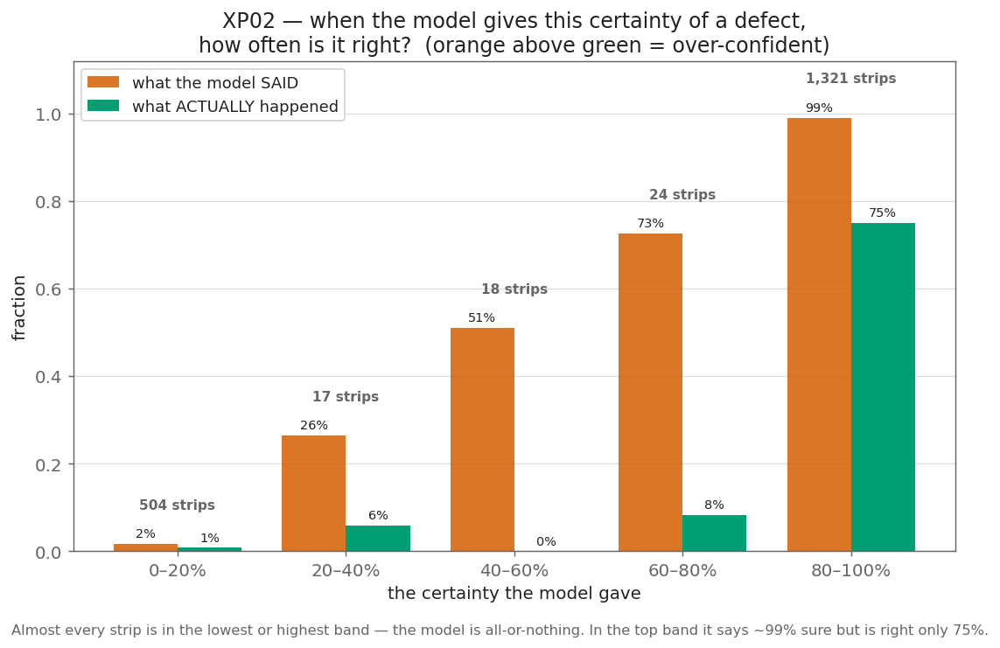
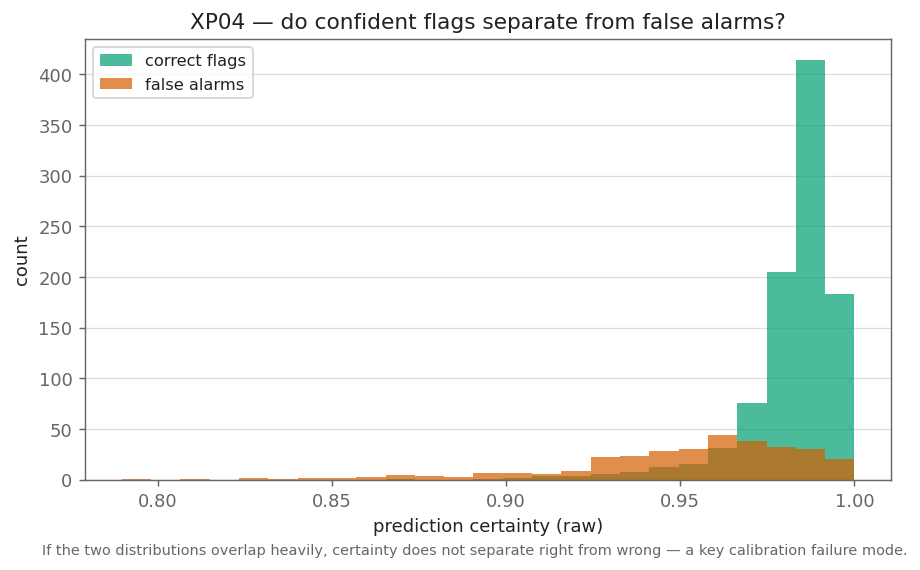

# XP02 — Calibration: can we trust the model's certainty?

**Question.** For each strip the model produces a **certainty that there's a defect**. If it
says **80% sure**, is there really a defect **80% of the time**? That property —
*calibration* — is what lets a factory route uncertain strips to a human. It is separate
from accuracy: a model can be accurate and still lie about how sure it is.

We look at the simple, operator-facing decision: **defect vs clean** (any of the four
classes), not per-class.

**No retraining.** This is post-hoc analysis of the XP01 model's own outputs. Temperature
scaling fits **one number** on validation — a calibration transform, not a weight update.

## The certainty measure

For each strip, certainty = how strong the **strongest defect evidence** is: the average of
the 200 most defect-like pixels, squashed to 0–1. Clean strips should score low, defect
strips high. Then, across the frozen test set, we bin strips by certainty and check: of the
strips it was ~C sure about, how many really had a defect?

## Results — the model is over-confident, and its certainty is all-or-nothing

Two findings on the frozen test set (53% of strips really have a defect):

1. **When it's sure, it's over-confident.** In the big high-certainty group (1,321 strips) —
   ones it is **~99% sure** have a defect — only **75%** actually do. So about **1 in 4
   confident "defect" calls is a false alarm** on clean steel.
2. **When it's unsure, it's trustworthy.** Strips it gives ~1% certainty are clean ~99% of
   the time. The low end is honest.

The catch is the shape: the model's certainty is **almost all-or-nothing** — it piles strips
at ~0% or ~100% and rarely says anything in between (see the histogram). So there's little
useful "70% sure, send to a human" middle ground.



**How to read it.** Strips are grouped by the certainty the model gave. In each band, the
**orange bar is what the model said** (its average certainty) and the **green bar is what
actually happened** (how often those strips really had a defect). When the two match, the
model is honest; **orange above green means over-confident**. It's over-confident in every
band, worst at the top: it says ~99% but is right ~75%. The strip counts show almost
everything lands in the lowest (504) or highest (1,321) band — the model is all-or-nothing.


*Certainty for strips that really have a defect (green) vs really clean (grey). Clean strips
sitting at high certainty are the false alarms.*

## ECE and temperature scaling, in plain words

- **ECE** (Expected Calibration Error) is one number for *how much the confidence lies*: the
  average gap between what the model says and what actually happens. ECE 0 = perfect; bigger
  = worse. If it says 90% but is right 70%, that's a 20-point gap.
- **Raw** = the number straight from the model. **Calibrated** = the same prediction after
  temperature scaling divides the model's internal score by one number (T) so the
  percentages become honest. Same decisions, more truthful numbers.

Here temperature scaling (T = 3.5) **barely helps**: overall ECE moves only 0.19 → 0.17
(the Brier score improves more, 0.18 → 0.13). One knob can't fix it, because the low-certainty
end is *already* honest and only the high-certainty end is inflated — so the miscalibration
is partly **structural**, not a simple uniform scale error.

## Verdict — is this certainty usable as a decision variable?

**As a raw probability, no** — "99% sure" really means "right ~75% of the time," and
temperature scaling only partly closes that gap. **As a coarse gate, yes**: *unsure* reliably
means clean, so the model can safely wave through the strips it's unsure about. But the
*sure* bucket still hides ~25% false alarms, and because the certainty is all-or-nothing
there's almost no calibrated middle band to route to a human. Calibration here is not a
one-line deploy fix — and XP07 will test whether even this much survives drift.

**Feeds:** XP08 — one candidate label-free drift signal is *confidence-distribution shift*.
That's only meaningful if confidence means something to begin with; XP02 decides whether it
earns a place in XP08, and XP07 will check whether the calibration survives drift.

## Blog post

*"When the model says 80%, is it right 80% of the time?"* — this experiment is the whole
post: the certainty measure, the reliability diagram, and whether one number fixes it.

## Reproduce

```bash
python experiments/xp02_calibration/calibrate.py     # no retraining; -> results/xp02_calibration.json
python experiments/xp02_calibration/make_figures.py  # -> results/figures/xp02_*.png
```
