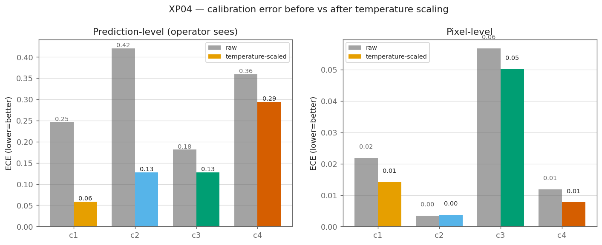

# XP02 — Calibration: can we trust the model's certainty?

**Question.** When the model flags class X, it also produces a confidence number. If it
says **80% sure**, is it right **80% of the time**? That property — *calibration* — is what
lets a factory route uncertain cases to a human. It is completely separate from accuracy: a
model can be accurate and still lie about how sure it is.

**No retraining.** This is post-hoc analysis of the XP01 model's own outputs. Temperature
scaling fits a **single number per class** on validation — a calibration transform, not a
weight update.

## The certainty measure

When the model fires class X on a strip, we take the **average confidence over the pixels
it flagged** as the certainty of that prediction. Then we ask, across the frozen test set:
of the flags made at certainty ≈ C, what fraction were actually correct? A well-calibrated
model lands on the diagonal (certainty = correctness).

We look at it two ways:
- **Prediction-level** — the operator-facing number above. "It flagged class 3 at 0.9."
- **Pixel-level** — the classic per-pixel view, for completeness.

## Results — the model is badly over-confident

When the model flags a class, it is on average **97% confident — but right only 75% of the
time.** Its confidence is nearly flat at ~0.97 regardless of whether it's actually correct,
which makes the raw number almost useless as a probability.

Prediction-level, per class (frozen holdout):

| Class | Says (mean confidence) | Actually right | ECE raw | Temp T | ECE after |
|---|---:|---:|---:|---:|---:|
| 1 | 99% | 74% | 0.25 | 3.3 | **0.06** |
| 2 | 99% | **57%** | 0.42 | 5.9 | 0.13 |
| 3 | 97% | 79% | 0.18 | 2.4 | 0.13 |
| 4 | 96% | 60% | 0.36 | 4.8 | 0.29 |
| **overall** | **97%** | **75%** | **0.22** | 2.8 | **0.15** |

**Class 2 is the sharpest example of the danger:** it says ~99% sure and is right barely
more than half the time — confidently wrong, exactly the silent-failure mode this whole
project exists to catch.


*Reliability per class: predicted certainty (x) vs how often it was actually correct (y).
The dashed line is perfect calibration. A curve **below** the line = over-confident (says
80%, right less often).*


*Calibration error (ECE — the average gap between confidence and correctness) before and
after temperature scaling. Left: prediction-level (what an operator sees). Right:
pixel-level.*


*Where confident flags (green) and false alarms (orange) fall on the certainty axis — they
sit right on top of each other near 1.0, so the raw certainty barely separates right from
wrong.*

### Does temperature scaling fix it?

Temperature scaling rescales every confidence by one number, without changing which class
ranks highest — accuracy is untouched, only the probabilities move.

**It helps, but only partly, and unevenly.** The fitted temperatures are large (T = 2.4–5.9,
where 1.0 = no change), which is itself a measure of how over-confident the model is. It
roughly halves the overall error (ECE 0.22 → 0.15) and nearly fixes classes 1 and 2 (0.25 →
0.06, 0.42 → 0.13). But it **barely moves class 4** (0.36 → 0.29) — so part of the
miscalibration is **structural**, not a simple scale issue, and no single scalar rescues it.

### The pixel-level trap

Measured per pixel, calibration looks *fine* (ECE ~0.03). That's misleading: pixel-level is
dominated by the vast, easy, confidently-correct background, so it hides the failure. The
**prediction-level** number — the one an operator actually sees — is where the model is
badly miscalibrated. When two views disagree like this, the operator-facing one is the truth.

## Verdict — is this confidence usable as a decision variable?

**Raw: no.** It sits at ~97% no matter what, so it carries almost no information about
whether the flag is right. **After per-class temperature scaling: usable with care** for
classes 1–3, but class 4 stays over-confident and should not be trusted as a probability.
Calibration is *not* a set-and-forget deploy step here — it's per-class, imperfect, and (as
XP07 will test) unlikely to survive drift unchanged.

**Feeds:** XP08 — one candidate label-free drift signal is *confidence-distribution shift*.
XP02's answer: that signal is only usable on **temperature-scaled, per-class** confidence,
never the raw number — and even then class 4 is weak. XP07 will check whether the
calibration holds up once conditions drift.

## Blog post

*"When the model says 80%, is it right 80% of the time?"* — this experiment is the whole
post: the certainty measure, the reliability diagram, and whether one scalar fixes it. It
stands alone and is useful to anyone deploying a model, not just this project.

## Reproduce

```bash
python experiments/xp02_calibration/calibrate.py     # no retraining; -> results/xp02_calibration.json
python experiments/xp02_calibration/make_figures.py  # -> results/figures/xp02_*.png
```
