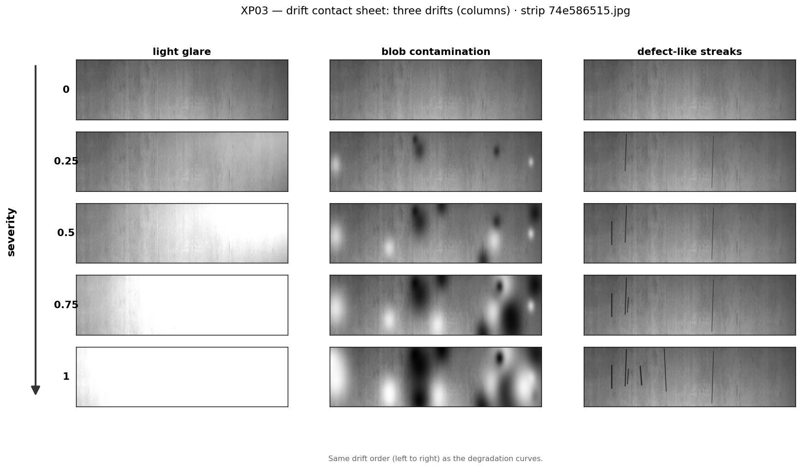
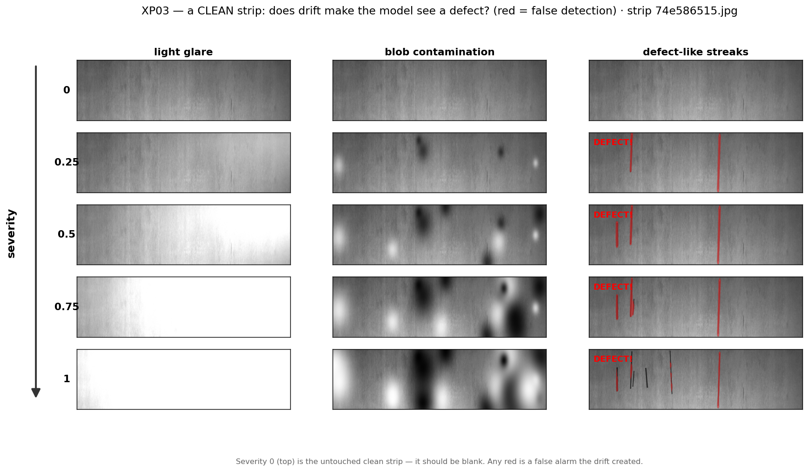
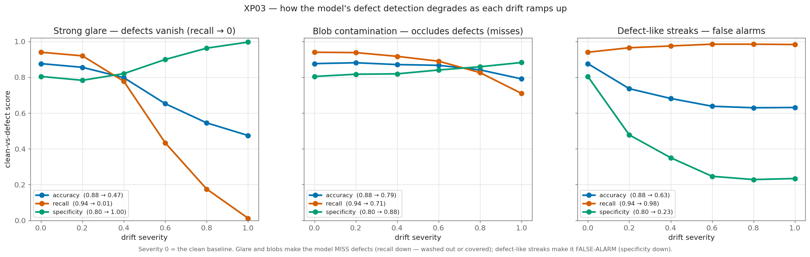

# XP03 — Drift: how much does a corrupted image break the model?

**Question.** A factory camera doesn't stay perfect — a lamp ages, oil films the lens, the
mount vibrates. As the *image* drifts (the steel underneath is unchanged), how much does the
model's **defect-vs-clean** decision degrade? This is the ground truth a label-free drift
monitor (later experiments) will have to predict without ever seeing the answer.

We simulate three named drifts, each with a **severity dial 0 → 1** (0 = untouched), and
measure accuracy on the frozen holdout as severity rises. The labels never change, so any
drop is honest degradation.

## The three drifts

The same strip under each drift (columns), at rising severity (rows):



- **Light glare (top-right)** — an aged/replaced lamp or a reflection over-exposes a corner.
- **Blob contamination** — random soft dark/bright spots: dirt, oil, dust on the lens.
- **Defect-like streaks** — thin dark scratches, *shaped like real class-3 defects*.

They're built to fail the model in three different ways, and they do.

### Seeing the false alarms directly

The same three drifts on a **genuinely clean strip**, with the model's detection overlaid
in red — severity 0 (top) is untouched and should stay blank, so any red is a false alarm
the drift invented:



It's unmistakable: **glare and blobs never turn red** — the model correctly keeps calling
the clean strip clean, even buried under dark blobs. But **the defect-like streaks light up
"DEFECT!" from severity 0.25 on** — the model paints the fake scratches as real defects.
That is the specificity collapse below, made visible.

## Results — three different failure modes



| Drift | Accuracy | What breaks | Failure mode |
|---|---|---|---|
| **Light glare** | 0.88 → **0.47** | **recall** 0.94 → **0.01** | **misses everything** (defects washed out) |
| **Blob contamination** | 0.88 → 0.79 | recall 0.94 → 0.71 | **mild misses** (defects covered) |
| **Defect-like streaks** | 0.88 → 0.63 | **specificity** 0.80 → **0.23** | **false alarms** (cries wolf) |

Reading each curve (recall = defects caught, specificity = clean strips left alone):

- **Strong glare is catastrophic.** By full severity it over-exposes most of the strip, so
  the model detects almost nothing — recall falls off a cliff, **0.94 → 0.01**. It stops
  firing entirely (specificity even climbs to 1.0), but it's blind: accuracy 0.88 → 0.47.
- **Blob contamination is a milder version of the same thing.** Big dark/bright blobs *cover*
  real defects, so some get missed — recall 0.94 → 0.71 — but the blobs don't look like
  defects, so there are no false alarms (specificity holds ~0.88).
- **Defect-like streaks are the opposite failure.** They look like real scratches, so the
  model fires on them — specificity collapses from 80% to 23% (one clean strip in four now
  gets a false "defect"). Shape is what matters: the same contamination is mild as blobs and
  ruinous as streaks.

## Why this matters for the drift monitor

Two lessons for the monitor, both from the *asymmetry*:

- **How much a drift hurts varies wildly** — glare knocks recall to ~0, blobs only to 0.71,
  and streaks don't touch recall but wreck specificity. A monitor can't just flag "the image
  changed"; it has to track *how much accuracy actually moved*, which differs several-fold
  between drifts.
- **The failure direction differs too** — glare and blobs cause **misses**, streaks cause
  **false alarms**. A good monitor should react to all three, because all three break the
  model, just in different ways.

XP03 is the ground truth; the label-free signals (XP08) will be judged on whether they track
*these* curves.

## Reproduce

```bash
python experiments/xp03_drift/contact_sheet.py    # the severity contact sheet
python experiments/xp03_drift/clean_detection.py  # false-alarm overlay on a clean strip (needs the model)
python experiments/xp03_drift/degradation.py      # accuracy vs severity -> results/xp03_degradation.json
python experiments/xp03_drift/make_figures.py     # the degradation curves
```
